# INNOVADENT - Diagrama Entidad-Relación (ERD)

## Diagramas de Relaciones por Módulo

Este documento contiene los diagramas ERD de cada módulo del sistema INNOVADENT usando sintaxis Mermaid.

---

## 1. MÓDULO: CONFIGURACIÓN Y MULTIEMPRESA

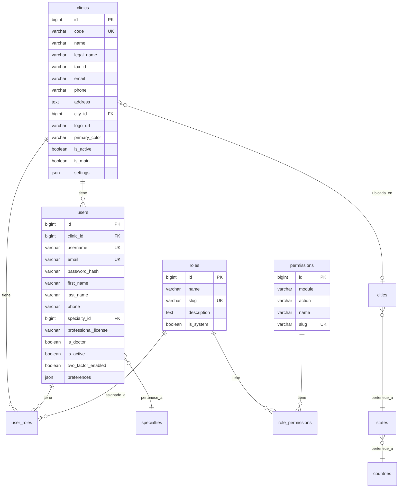

---

## 2. MÓDULO: PACIENTES

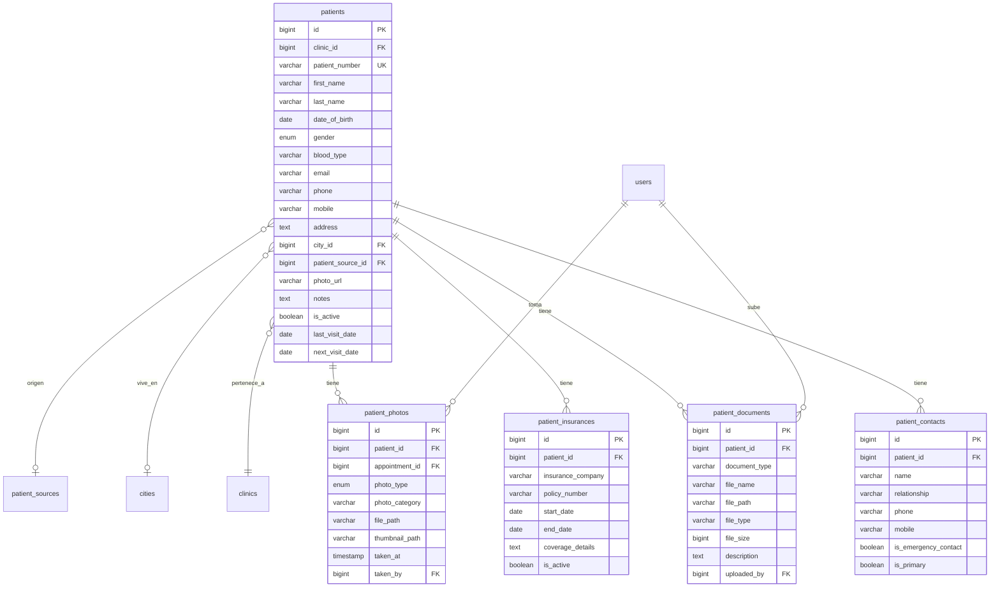

---

## 3. MÓDULO: AGENDA Y CITAS

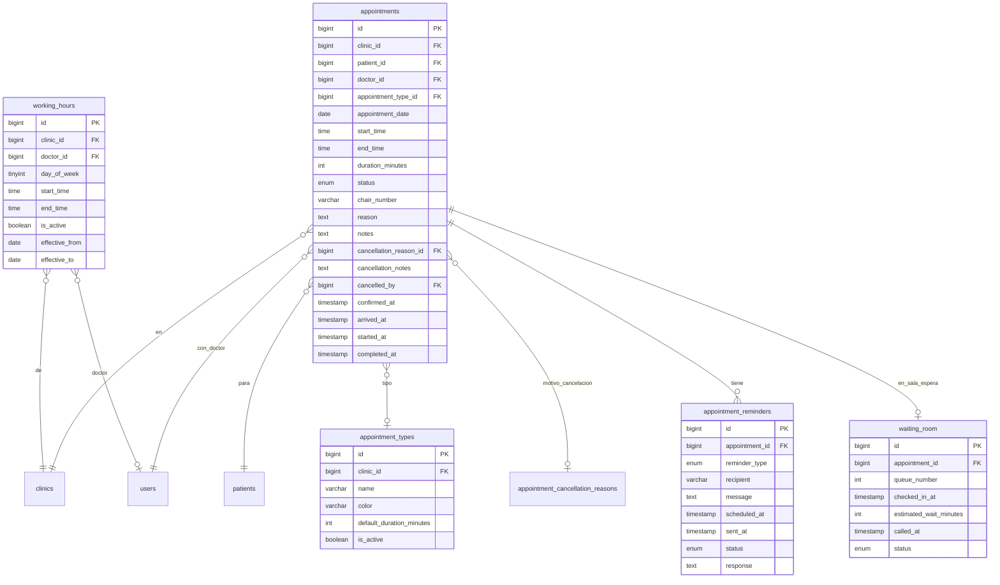

---

## 4. MÓDULO: HISTORIA CLÍNICA

```mermaid
erDiagram
    patients ||--o| medical_histories : "tiene"
    patients ||--o{ clinical_notes : "tiene"
    patients ||--o{ vital_signs : "tiene"
    patients ||--o{ allergies : "tiene"
    patients ||--o{ medications : "tiene"
    patients ||--o{ informed_consents : "firma"
    appointments ||--o{ clinical_notes : "genera"
    appointments ||--o{ vital_signs : "registra"
    users ||--o{ clinical_notes : "escribe"
    users ||--o{ vital_signs : "toma"
    users ||--o{ informed_consents : "solicita"
    treatments ||--o{ informed_consents : "para"

    medical_histories {
        bigint id PK
        bigint patient_id FK_UK
        boolean has_systemic_diseases
        text systemic_diseases
        boolean has_heart_disease
        text heart_disease_details
        boolean has_respiratory_disease
        boolean has_kidney_disease
        boolean has_bleeding_disorders
        boolean is_pregnant
        int pregnancy_weeks
        boolean is_smoker
        varchar smoking_frequency
        boolean consumes_alcohol
        text previous_surgeries
        text dental_history
        text dental_hygiene_habits
        varchar brushing_frequency
        date last_dental_visit
        text fears_or_anxieties
        text additional_notes
    }

    clinical_notes {
        bigint id PK
        bigint patient_id FK
        bigint appointment_id FK
        bigint doctor_id FK
        enum note_type
        varchar subject
        text content
    }

    vital_signs {
        bigint id PK
        bigint patient_id FK
        bigint appointment_id FK
        int blood_pressure_systolic
        int blood_pressure_diastolic
        int heart_rate
        decimal temperature
        int respiratory_rate
        decimal oxygen_saturation
        decimal glucose
        decimal weight
        decimal height
        bigint measured_by FK
        timestamp measured_at
    }

    allergies {
        bigint id PK
        bigint patient_id FK
        varchar allergen
        enum allergen_type
        text reaction
        enum severity
        date diagnosed_date
        boolean is_active
    }

    medications {
        bigint id PK
        bigint patient_id FK
        varchar medication_name
        varchar dosage
        varchar frequency
        enum route
        text reason
        date start_date
        date end_date
        boolean is_current
        varchar prescribed_by
    }

    informed_consents {
        bigint id PK
        bigint patient_id FK
        bigint treatment_id FK
        varchar title
        text content
        timestamp signed_at
        text signature_data
        varchar witness_name
        text witness_signature_data
        bigint doctor_id FK
        varchar document_path
    }
```

---

## 5. MÓDULO: ODONTOGRAMA Y PERIODONTOGRAMA

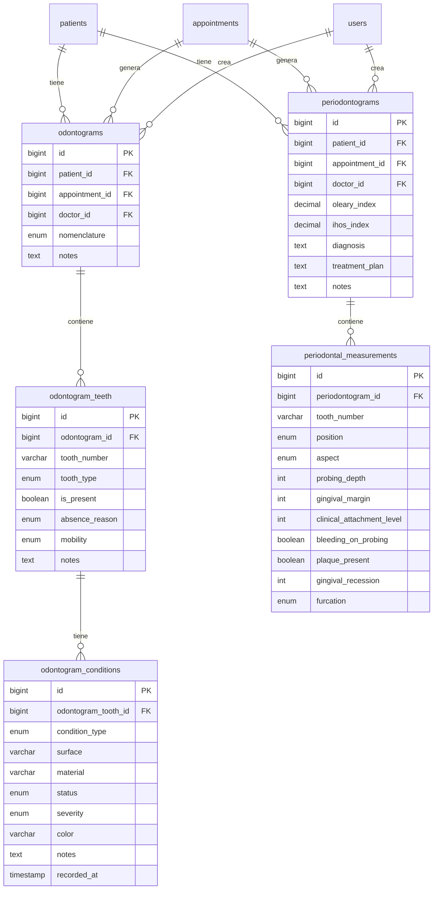

---

## 6. MÓDULO: ORTODONCIA

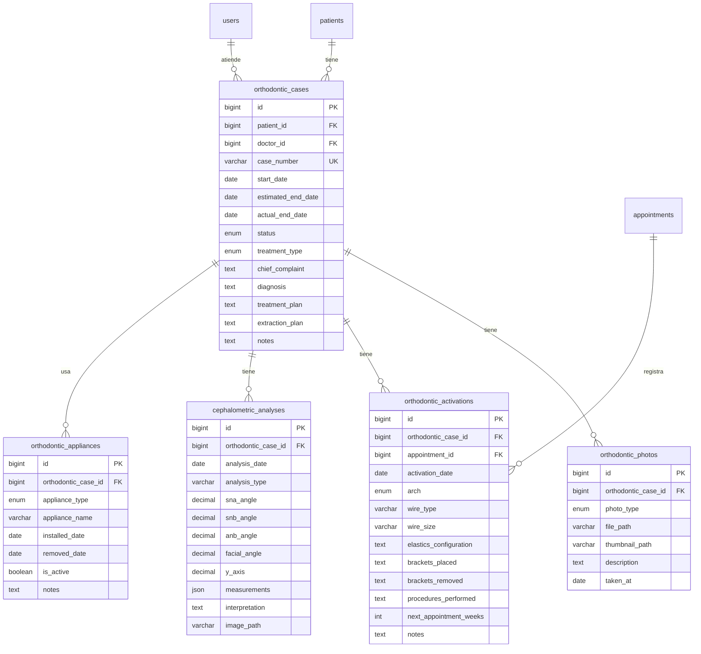

---

## 7. MÓDULO: TRATAMIENTOS Y PRESUPUESTOS

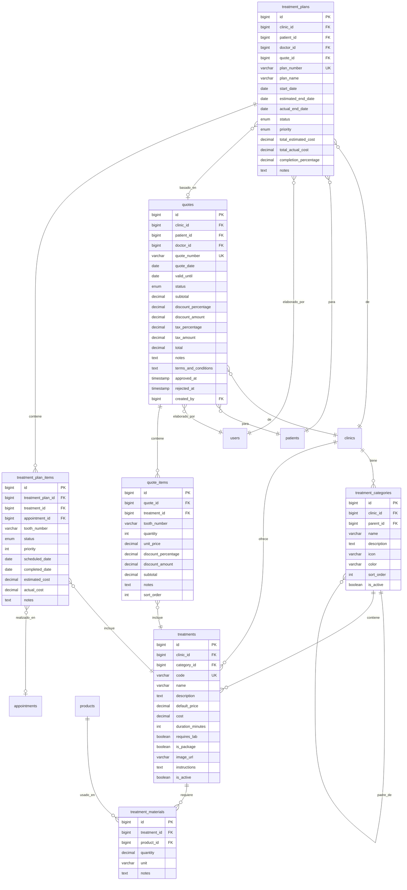

---

## 8. MÓDULO: FACTURACIÓN Y PAGOS

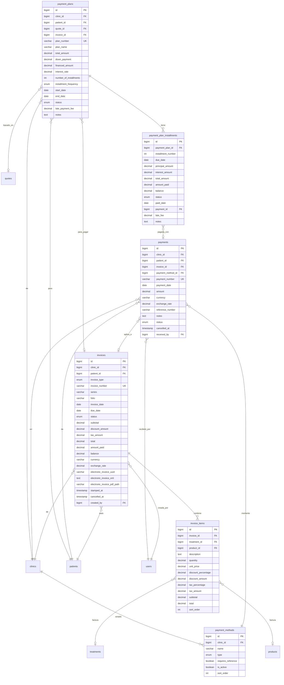

---

## 9. MÓDULO: CONTROL FINANCIERO

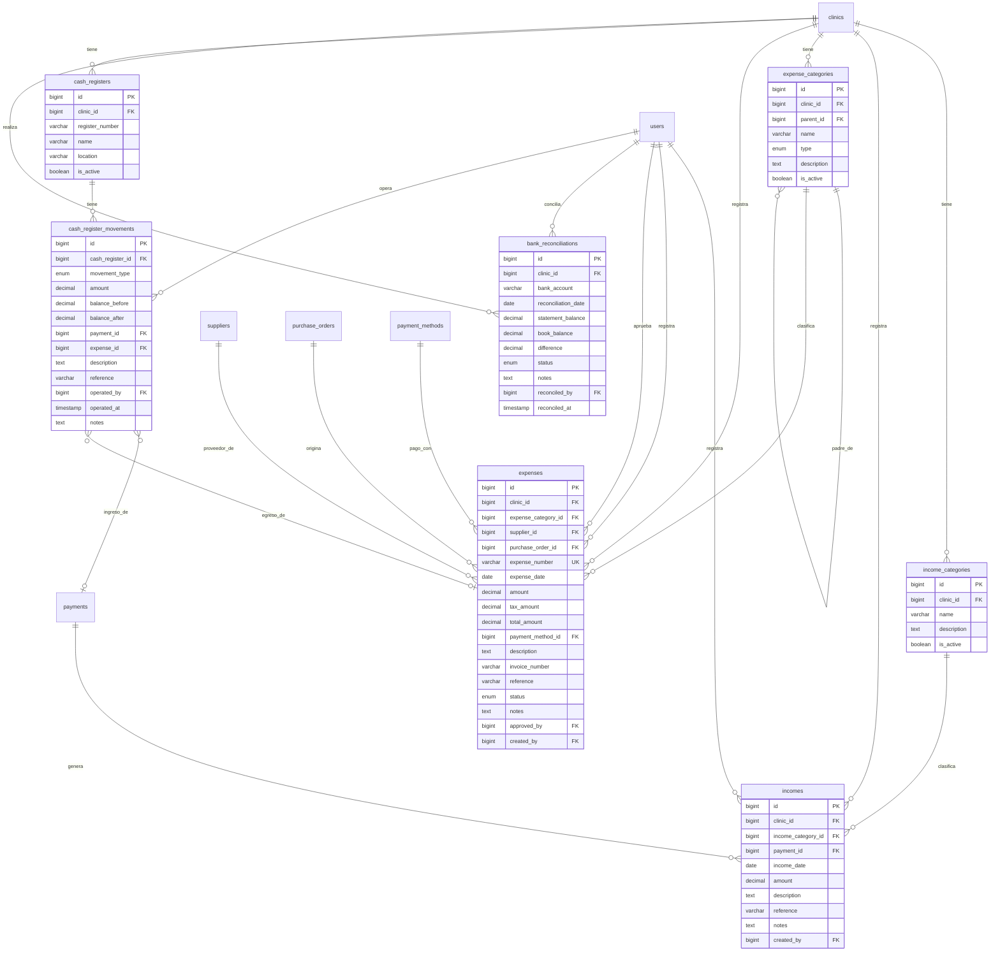

---

## 10. MÓDULO: INVENTARIO Y COMPRAS

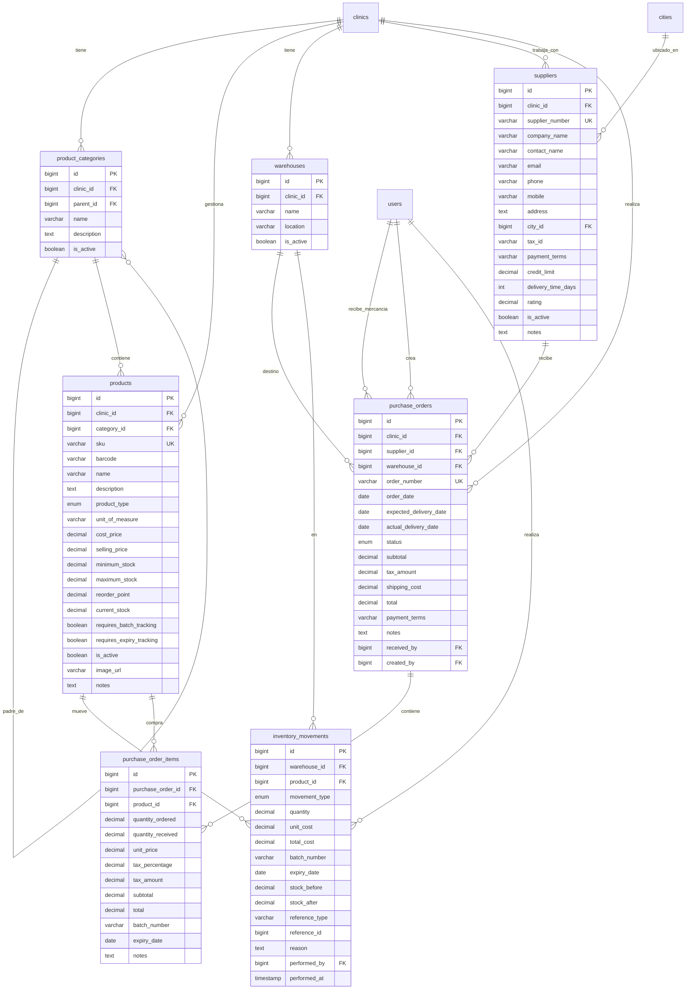

---

## 11. MÓDULO: LABORATORIO DENTAL

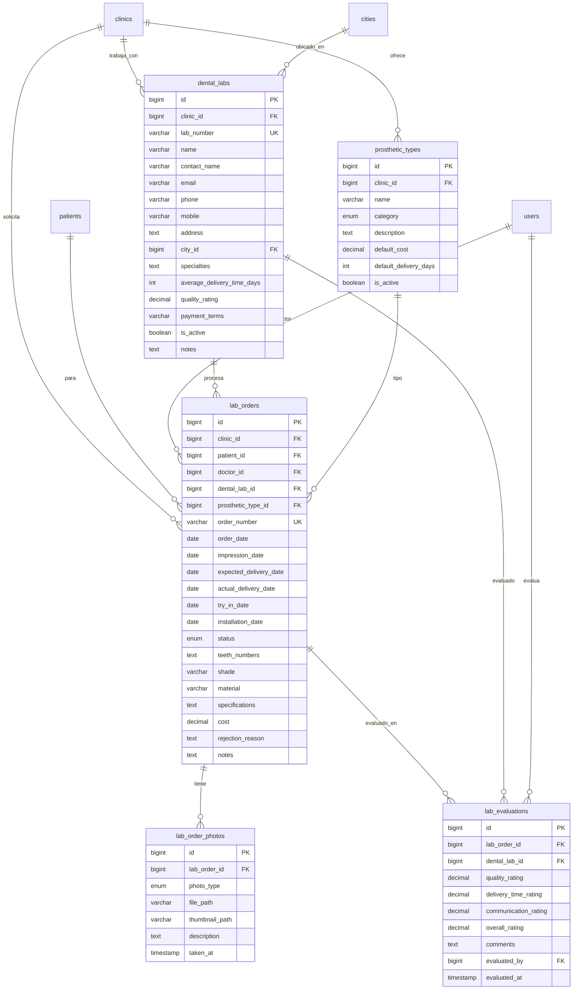

---

## 12. MÓDULO: COMUNICACIÓN Y AUDITORÍA

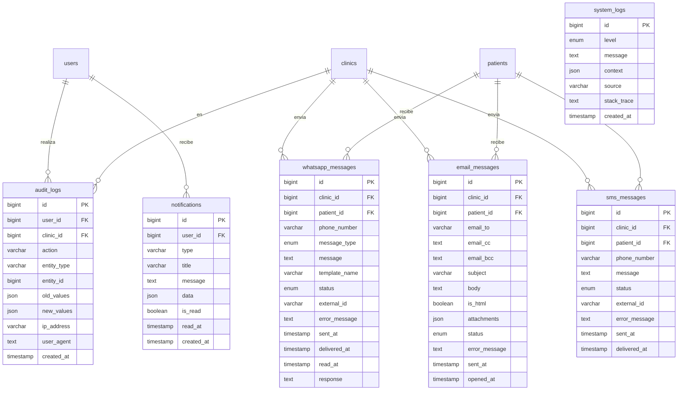

---

## Resumen de Cardinalidades

### Relaciones Principales

- **One-to-Many (1:N)**: La mayoría de las relaciones
  - Una clínica tiene muchos usuarios
  - Un paciente tiene muchas citas
  - Un odontograma contiene muchos dientes
  - Un presupuesto contiene muchos ítems

- **Many-to-Many (N:M)**: A través de tablas intermedias
  - Roles y Permisos (role_permissions)
  - Usuarios y Roles (user_roles)
  - Tratamientos y Materiales (treatment_materials)

- **One-to-One (1:1)**:
  - Paciente y Historia Clínica (medical_histories)

### Índices Importantes

Todas las tablas incluyen:
- ✅ Primary Key (id)
- ✅ Foreign Keys indexadas
- ✅ Campos de búsqueda indexados (name, email, code, etc.)
- ✅ Campos de filtrado indexados (status, is_active, type, etc.)
- ✅ Campos de fecha indexados (created_at, appointment_date, etc.)

### Estrategias de Optimización

1. **Soft Deletes**: Uso de `deleted_at` en lugar de eliminar físicamente
2. **Timestamps**: `created_at` y `updated_at` en todas las tablas principales
3. **JSON Fields**: Para datos flexibles (settings, preferences, measurements)
4. **ENUM Types**: Para campos con valores predefinidos (status, type, etc.)
5. **Decimal Precision**: Para valores monetarios y mediciones precisas

---

*Diagramas ERD generados para INNOVADENT v1.0*
*Última actualización: 2025*
